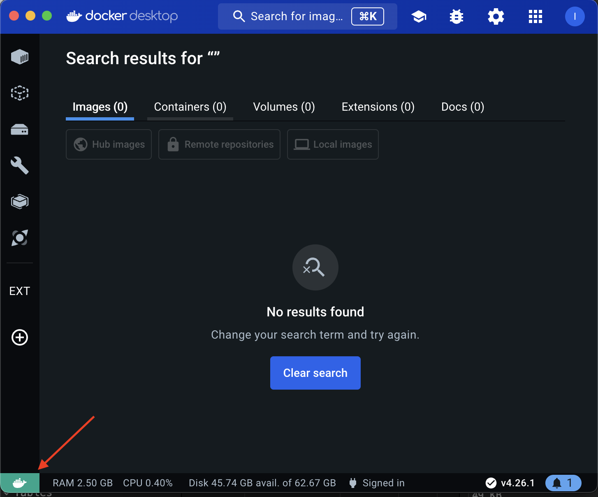
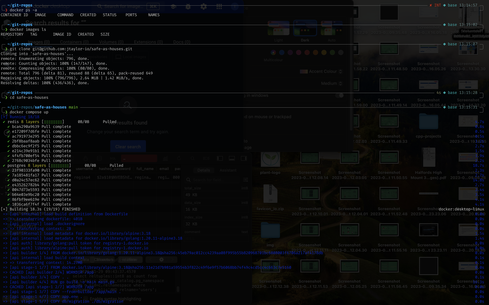
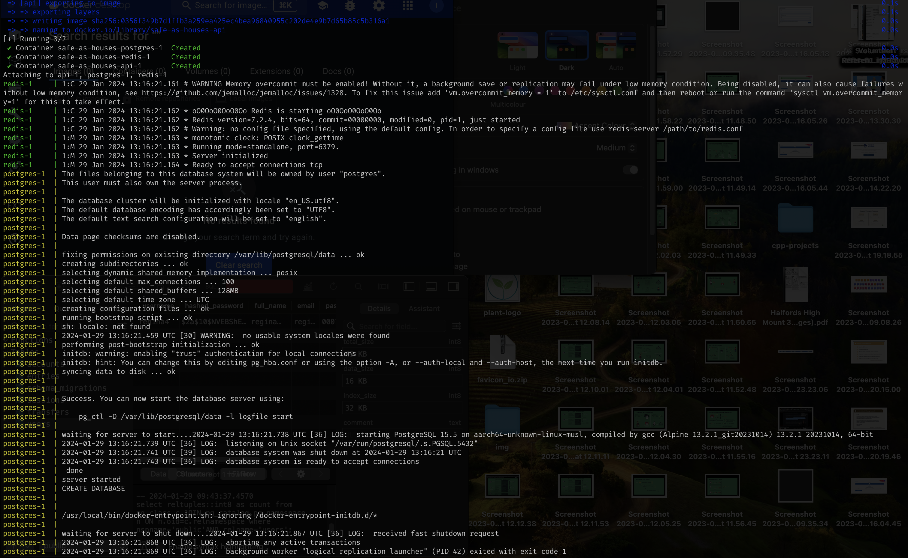
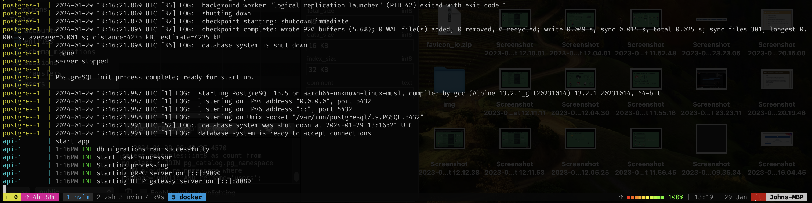

# safe-as-houses


## Project Background and Motivation

Welcome 👋

This is a personal project to explore a few new technologies, particularly the [Go](https://go.dev/) programming language.

Shout out to this cracking [Udemy Course](https://www.udemy.com/share/105PNI3@ptNeUFqPXl87M7BBxB5kSQZEIpklWXrRU6OV240Xc4AsjFAC2swizlcaq5jnA-Fqqg==/) for the inspiration!

## 🚧 Disclaimer 🚧

This is a work in progress 🏗️ and as such could be in an 'interim state' without notice.

## Deployment

~~I am currently deploying service to AWS EKS via Github actions workflow.~~

~~api swagger docs can be found~~ [~~here~~](https://api.safe-as-houses.jtaylor.io/swagger)

I have deleted the AWS infrastructure to save money 🏦.
An EKS cluster is a solid choice IMHO for a production setup but the daily cost of just running this demo isn't worth it 💸.
When I get a chance, I will get it deployed onto a cheaper setup for demo 👍.

## Local Development

### Prerequisite tooling

- [Docker Desktop](https://www.docker.com/products/docker-desktop/)
  - Note: launching Docker Desktop starts the Docker daemon (Green whale in bottom left = running)
    
- [Golang](https://go.dev/)
- [Migrate](https://github.com/golang-migrate/migrate/tree/master/cmd/migrate)
- [sqlc](https://docs.sqlc.dev/en/latest/overview/install.html)
- [gomock](https://github.com/uber-go/mock)
- [dbdocs](https://dbdocs.io/docs)
- [dbml cli](https://dbml.dbdiagram.io/cli/#installation)
- [evans grpc client](https://github.com/ktr0731/evans?tab=readme-ov-file#installation)

### Starting service

The service can be run locally either using

- [Docker compose](https://docs.docker.com/compose/intro/features-uses/)

```
# in project root directory run:
docker compose up
```

<div></div>
<div></div>
<div></div>

- OR using utilities in [Makefile](./Makefile).

## Notes

[K8s installation notes](./doc/k8s_installation.md)
